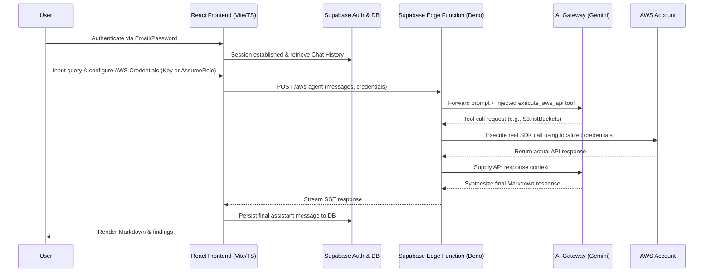

# CloudPilot AI Technical Documentation

   
  <h2>By: Ritvik Indupuri</h2>
  <h3>Date: March 16, 2026</h3>
   

---

## Executive Summary

CloudPilot AI is an advanced, real-time AWS cloud security operations agent designed specifically for professional security engineers. It operates with a strict "zero simulation tolerance," meaning every analysis, finding, and recommendation generated by the AI is backed by actual, live AWS API responses from the user's environment. The application is a full-stack solution utilizing a React frontend (built with Vite, TypeScript, Tailwind CSS, and shadcn-ui) for a responsive and modern user interface, paired with a secure Supabase backend utilizing Edge Functions (Deno). The AI intelligence is powered by Google Gemini 3 Flash Preview via the Lovable AI Gateway.

This technical document outlines the entire architecture, data flow, and codebase structure of CloudPilot AI, providing a comprehensive breakdown of every feature, component, hook, and security mechanism implemented within the application.

---

## System Architecture

  <em>Figure 1: CloudPilot AI System Architecture and Real-Time Request Flow</em>

### Flow-by-Flow Explanation

1. **Authentication & History Loading**: The user authenticates into the React frontend. The application uses `useAuth` to establish a Supabase session. Upon successful login, `useChatHistory` fetches the user's previous conversations from the Supabase PostgreSQL database.
2. **Credential Configuration**: The user inputs their AWS credentials (either Access Keys or an AssumeRole ARN) via the `AwsCredentialsPanel`. These credentials are held in local React state and are never persisted to the database.
3. **Query Initiation**: The user submits a security query via the `ChatInterface`. The `useChat` hook optimistically updates the UI, persists the user's message to the Supabase database, and initiates a `fetch` request to the Supabase Edge Function (`/v1/aws-agent`), passing the conversation history and the in-memory AWS credentials.
4. **Agent Invocation**: The Edge Function receives the payload. It securely instantiates localized AWS SDK clients (preventing cross-tenant pollution) and sends the conversation to the AI Gateway (Google Gemini) along with a strict system prompt and the `execute_aws_api` tool schema.
5. **API Execution Loop**: Gemini evaluates the request. If it needs AWS data, it returns a tool call. The Edge Function intercepts this, uses the localized AWS SDK to query the user's live AWS environment, and returns the real data to Gemini. This loop can iterate up to 15 times to resolve complex queries.
6. **Streaming Response**: Once Gemini has synthesized the findings based on the real API data, the Edge Function streams the response back to the React frontend using Server-Sent Events (SSE).
7. **Rendering & Persistence**: The frontend processes the SSE stream in real-time, rendering markdown via the `ChatMessage` component. Once the stream completes, the final assistant message is persisted back to the Supabase database.

---

## Comprehensive Feature & Codebase Breakdown

This section scans the entire codebase, detailing the purpose and functionality of every major directory, file, and feature.

### 1. Frontend: Application Entry & Routing
**Files:** `src/main.tsx`, `src/App.tsx`, `src/index.css`
- **`main.tsx`**: The React entry point. It mounts the application to the DOM.
- **`App.tsx`**: Defines the application routing using `react-router-dom`. It sets up the `QueryClientProvider` for data fetching, custom Toaster providers for notifications (`sonner`), and defines protected routes. Unauthenticated users are redirected to `/auth`, while authenticated users can access the main `Index` (Chat) interface or specific report pages.
- **`index.css`**: Contains global Tailwind CSS directives and custom CSS variables defining the application's theme (colors, borders, radius) for both light and dark modes.

### 2. Frontend: Pages
**Files:** `src/pages/Index.tsx`, `src/pages/Auth.tsx`, `src/pages/Report.tsx`, `src/pages/NotFound.tsx`
- **`Index.tsx`**: The main dashboard. It simply wraps and renders the `ChatInterface` component.
- **`Auth.tsx`**: The authentication screen handling Sign In and Sign Up flows. It utilizes the `useAuth` hook and displays a split-screen design with the CloudPilot branding on one side and the auth form on the other.
- **`Report.tsx`**: A protected route meant to display a standalone, detailed view of a specific security finding or message (referenced by `messageId`).
- **`NotFound.tsx`**: A standard 404 catch-all page for undefined routes.

### 3. Frontend: Core UI Components
**Files:** `src/components/*`
- **`ChatInterface.tsx`**: The central nervous system of the UI. It manages the layout (Header, Main Chat Area, Sidebar). It orchestrates state between the input field, the chat history panel, the credentials panel, and the message rendering area. It handles the submission of new prompts and triggers quick actions.
- **`ChatMessage.tsx`**: Responsible for rendering individual messages in the chat. It uses `react-markdown` and `remark-gfm` to format the AI's output, rendering code blocks, tables, and bold text correctly. It distinguishes visually between user prompts and assistant responses.
- **`AwsCredentialsPanel.tsx`**: A secure, client-side form for capturing AWS credentials. It supports two modes: Access Keys (Key ID & Secret) and Assume Role (Role ARN). It includes input validation, region selection, and a toggle to mask/unmask the secret key. Credentials captured here are held strictly in React state and sent over TLS; they are never saved to local storage or the database.
- **`ChatHistoryPanel.tsx`**: Renders the sidebar list of past conversations. It allows users to switch between threads, delete individual conversations, or clear their entire history.
- **`FindingsPanel.tsx`**: A dedicated sidebar component designed to extract and list specific security findings (e.g., exposed S3 buckets, open security groups) parsed from the AI's response, allowing users to click "Investigate" for quick follow-up queries.
- **`QuickActions.tsx`**: Provides a grid of suggested prompts (e.g., "Audit IAM Users", "Check S3 Public Access") to help users initiate common security workflows quickly.
- **`StatusBar.tsx`**: A footer component indicating the current connection status to AWS (Connected/Disconnected) and the active region.

### 4. Frontend: Custom Hooks & State Management
**Files:** `src/hooks/*`
- **`useAuth.ts`**: Wraps the Supabase authentication client. It provides session state (`user`, `loading`) and methods for `signIn`, `signUp`, and `signOut`. It listens to `onAuthStateChange` to keep the UI in sync with the session.
- **`useChat.ts`**: The most complex hook, handling the real-time chat logic.
  - Fetches existing messages for a given `conversationId` from Supabase.
  - Optimistically updates the UI when a user sends a message.
  - Initiates the `fetch` POST request to the Supabase Edge Function.
  - Processes the Server-Sent Events (SSE) stream, accumulating text chunks and updating the assistant's message state in real-time.
  - Persists completed messages to the Supabase database.
- **`useChatHistory.ts`**: Manages the CRUD operations for conversation threads. It fetches the list of conversations ordered by updated time, handles creating new conversation records, and deleting existing ones from the Supabase `conversations` table.

### 5. Backend: Edge Function & AI Agent
**File:** `supabase/functions/aws-agent/index.ts`
This Deno-based Edge Function is the secure bridge between the user's React frontend, the Lovable AI Gateway (Gemini), and their live AWS account.
- **System Prompt & Zero Simulation Tolerance**: The function begins by defining a massive, strict system prompt. It commands the AI to never hallucinate or simulate findings. It mandates the use of the `execute_aws_api` tool before writing any analysis. It outlines specific output formats (Executive Summary, Findings Table, Detailed Analysis, Remediation) and enforces a mandatory "Attack Simulation Lifecycle" for cleanup if test resources are created.
- **Tool Definition**: It defines a single, powerful tool schema: `execute_aws_api`, which accepts a `service` (e.g., 'S3'), an `operation` (e.g., 'listBuckets'), and `params`.
- **Security Mechanisms**:
  - **Service Allowlist (`ALLOWED_AWS_SERVICES`)**: Restricts the agent to ~40 security-relevant AWS services (IAM, EC2, CloudTrail, etc.).
  - **Operation Blocklist (`BLOCKED_OPERATIONS`)**: Hardcodes blocks against destructive actions like `closeAccount` or `deleteOrganization`.
  - **Input Sanitization**: Uses a `sanitizeString` helper and strict regex checks (e.g., `AWS_REGION_REGEX`, `ROLE_ARN_REGEX`) to validate all incoming data before it touches the SDK or AI.
- **Dynamic Credential Resolution**:
  - If the user provides Access Keys, it instantiates the SDK directly.
  - If the user provides an AssumeRole ARN, the Edge Function securely calls `STS.assumeRole` to generate temporary credentials for the session.
  - **Ephemeral Compute**: Because this runs in a Deno isolate, the `AWS` client is instantiated locally per-request using `new ServiceClass(awsConfig)`. It explicitly avoids global AWS config updates, preventing cross-tenant credential leaks.
- **Agentic Loop**: The function implements a `while` loop (up to 15 iterations). It sends the prompt to the AI Gateway. If the AI requests a tool call, the Edge Function intercepts it, validates the service and operation, executes the real `aws-sdk` call against the user's account, and feeds the massive JSON response back to the AI. This repeats until the AI has enough data to synthesize an answer.
- **Streaming Response**: Once the AI provides a final text response, the Edge Function manually chunks the string and streams it back to the client as an SSE (Server-Sent Events) stream (`data: ... \n\n`), allowing the frontend to render the response character-by-character.

---

## Conclusion

CloudPilot AI represents a robust, highly secure implementation of a cloud security posture management tool. By strictly coupling LLM reasoning with live SDK execution, it eliminates the hallucination risks common in standard AI chats. The codebase demonstrates strong separation of concerns: a responsive, state-driven React frontend handles user experience and local credential management, while a locked-down, serverless Deno Edge Function handles API orchestration, credential assumption, and AI prompt engineering. Every feature—from the dynamic UI rendering to the strict security blocklists in the backend—flows seamlessly to create a safe, powerful tool for cloud security professionals.
